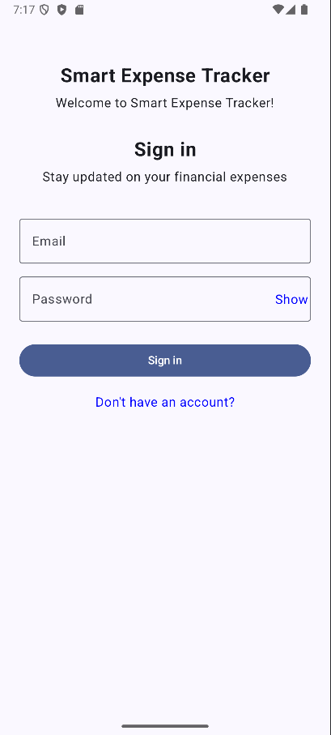
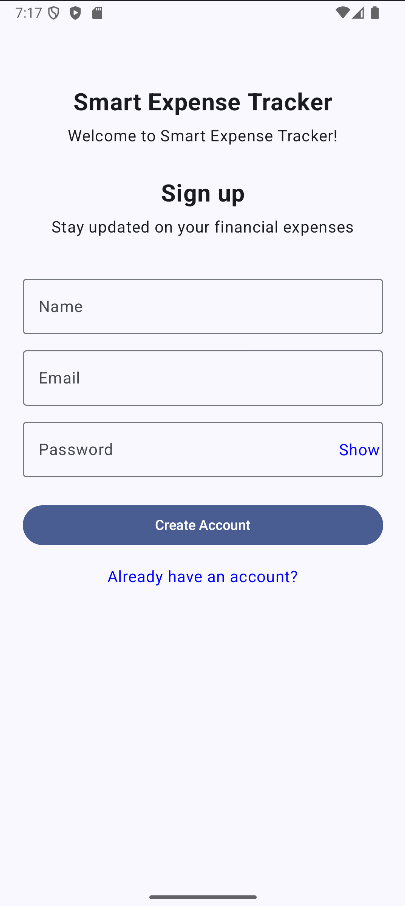
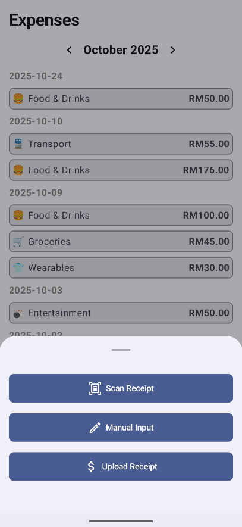
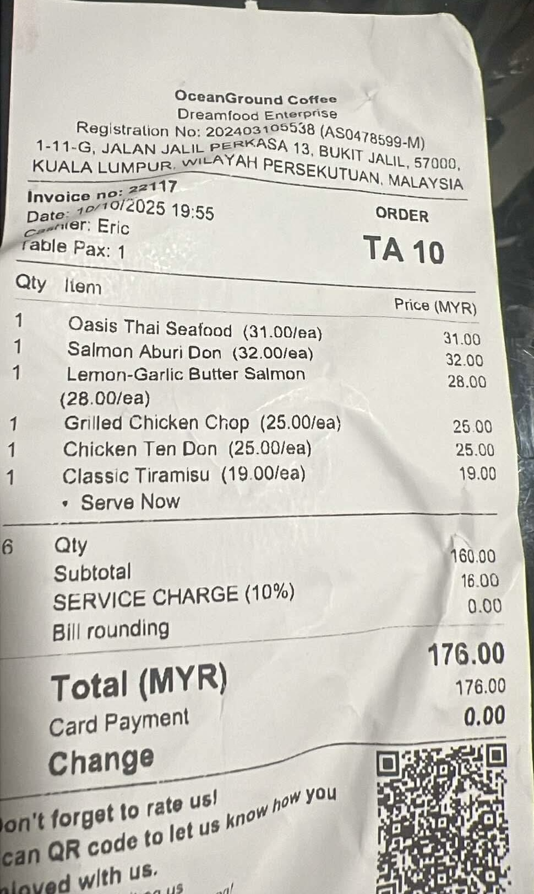
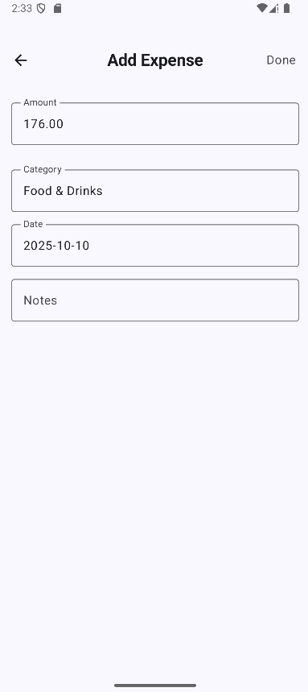
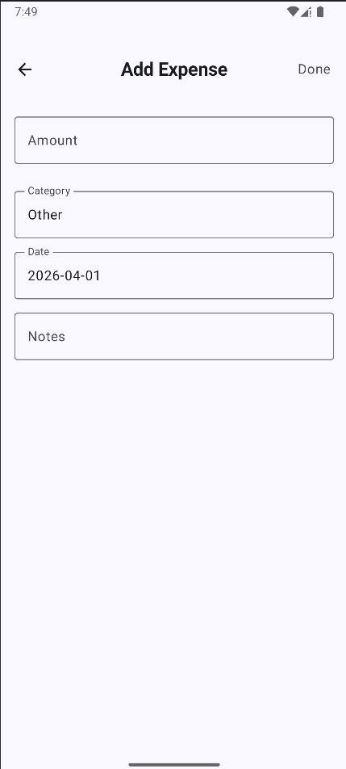
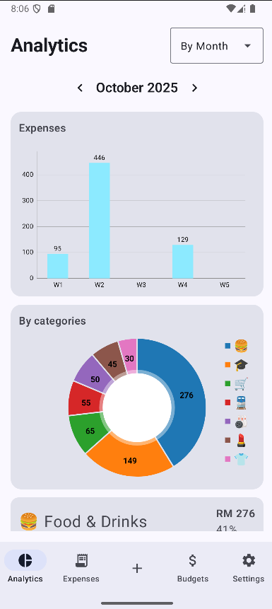
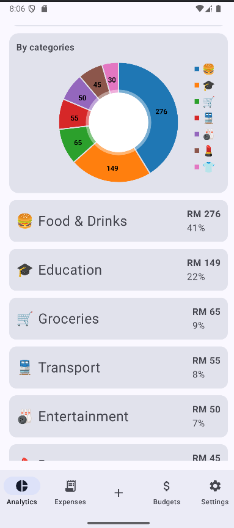
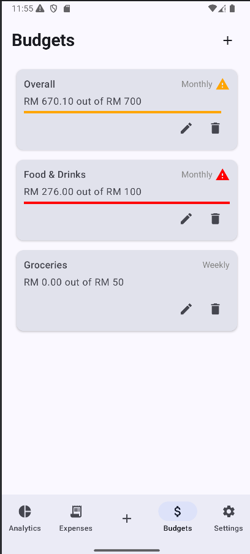

# 💰 Smart Expense Tracker with OCR & AI Analytics

A mobile application that automates expense tracking by combining **OCR (Optical Character Recognition)** and **AI-powered categorisation**, with integrated analytics and budgeting features.

---

## 📌 Project Overview

Managing personal expenses manually is time-consuming and error-prone. Users often forget to log expenses or miscategorise them, resulting in poor financial awareness.

This project aims to solve that problem by:
- 📸 Scanning receipts using OCR (Optical Character Recognition)
- 🤖 Automatically categorising expenses using AI
- 📊 Providing analytics and insights on spending habits
- 💸 Supporting budgeting to help users manage finances effectively

---

## 🏗️ System Architecture

    Mobile App
        ↓
    OCR Engine (Receipt Parsing)
        ↓
    Extracted Text Data 
        ↓ 
    Text Preprocessing 
        ↓ 
    TF-IDF Vectorizer 
        ↓ 
    Linear SVM Model 
        ↓
    Predicted Category
        ↓
    Mobile App

---

## 📸 Screenshots

### 🔹 Sign In & Sign Up Screen

  
  

### 🔹 Add Expense Options

  

### 🔹 Receipt Scanning (OCR & Category Prediction Result)

  
  

### 🔹 Manual Expense Entry

  

### 🔹 Analytics Dashboard

  
  

### 🔹 Budget Tracking

  

---

## 🚀 Features

### ✅ Core Features
- 📸 **Receipt Scanning (OCR)**  
  Extracts key information such as total amount, date, and merchant from receipt images.

- 🤖 **AI Expense Categorisation**  
  Automatically classifies expenses the following categories:
  - Food & Drinks  
  - Entertainment  
  - Groceries  
  - Transport  
  - Home  
  - Wearables  
  - Beauty  
  - Healthcare  
  - Education
  - Others

- 📊 **Analytics Dashboard**  
  Visualises spending patterns using bar charts and pie charts.

- 💰 **Budget Tracking**  
  Monitor spending against budget limits.

- ✍️ **Manual Expense Entry**  
  Allows users to input expenses manually when OCR is unavailable.

---

## 🧠 AI Categorisation Model

- **Input:** OCR-extracted receipt text  
- **Preprocessing:** Text cleaning and normalization  
- **Feature Extraction:** TF-IDF (unigrams + bigrams)  
- **Model:** Linear Support Vector Machine (LinearSVC)  
- **Handling Imbalance:** Class weights  
- **Evaluation:** Classification report and confusion matrix

### Model Pipeline

---

## 🛠️ Tech Stack

### Frontend (Mobile App)
- Android (Kotlin, Jetpack Compose)

### Backend
- **Firebase** (data storage)
- **FastAPI** (for AI categorisation)

### Machine Learning
- **Python**
- **Scikit-learn**
  - TF-IDF Vectorizer
  - Linear SVM
 
### Data Processing
- Pandas
- NumPy

---
